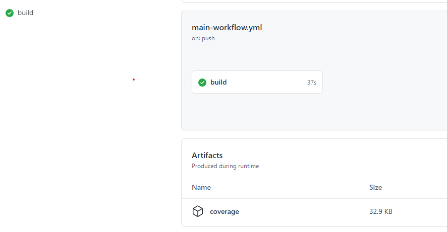

# Infer and Report by type

[](https://mermaid-js.github.io/mermaid-live-editor/#/edit/eyJjb2RlIjoiZ3JhcGggTFJcbiAgICBBKElucHV0IHZhbHVlKSAtLT4gQihMb29rdXAgY29vbGluZy50eXBlKVxuICAgIEIgLS0-IEMoUEFTU0lWRSlcbiAgICBCIC0tPiBEKEhJX0FDVElWRSlcbiAgICBCIC0tPiBFKE1FRF9BQ1RJVkUpXG4gICAgQyAtLT4gRihjbGFzc2lmeSBicmVhY2gtY2hlY2spXG4gICAgRCAtLT4gRlxuICAgIEUgLS0-IEZcbiAgICBGIC0tPiBHKGluZmVyIGJyZWFjaClcbiAgICBHIC0tPiBIKHRvIGNvbnRyb2xsZXIpXG4gICAgRyAtLT4gSSh0byBlbWFpbClcbiAgICBJIC0tPiB8aGlnaHxKKEhpZ2ggbWVzc2FnZSlcbiAgICBJIC0tPiB8bG93fEsoTG93IG1lc3NhZ2UpIiwibWVybWFpZCI6eyJ0aGVtZSI6ImRlZmF1bHQifSwidXBkYXRlRWRpdG9yIjpmYWxzZX0)

Use of switch-case / if-else ladders are common
while implementing the variations shown above.

Such structures limit the open-ness of the code,
limiting the possibility of parallel working
by multiple developers.

Try applying the strategy pattern to make the code more 'open'.

## Next: Coverage

This assignment will extend to cover testability as well.
Notice the coverage artifact created below your build jobs.

## Starting point

Pick a starting point for your trial.

[C](https://classroom.github.com/a/PT5hMf9N)

[C++](https://classroom.github.com/a/kAenjjEr)

[C#](https://classroom.github.com/a/n9GscJHo)

[Java](https://classroom.github.com/a/hEuyH99d)

[Python](https://classroom.github.com/a/UOV6GVk4)
